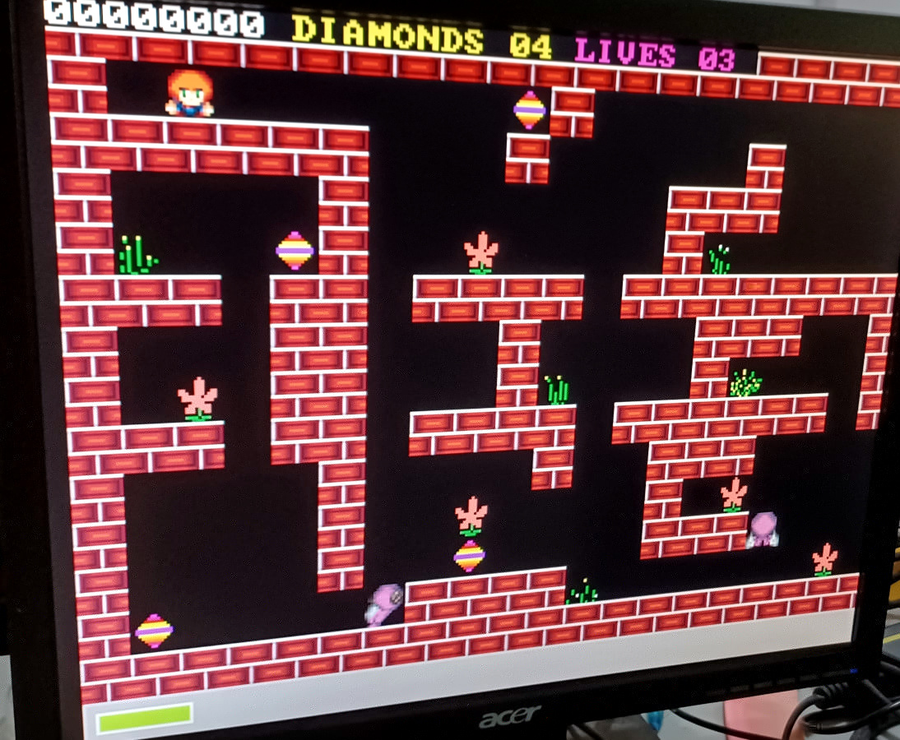

# About

This project is a game port to ESP-32 microcontroller of an MS-DOS Game.

Current status is alpha. 90% of the core mechanic has been implemented.

## Original MS-DOS


## ESP32-S3 VGA



I am also releasing the source code for the map editor:
https://github.com/cfrankb/cs3-map-edit

Try the online version of the game:
https://cfrankb.itch.io/creepspread-iii

# Software required

esp-idf v5.3 or later.

# Installation

This project is based in part on: https://github.com/spikepavel/ESP32-S3-VGA

```Shell
git clone https://github.com/cfrankb/ESP32-S3-VGA-TEST.git
cd ESP32-S3-VGA-TEST/
idf.py set-target esp32s3
idf.py menuconfig
idf.py flash
```

# Hardware

ESP32S3 + VGA Adapter

[see techdocs](techdocs/README.md) for details