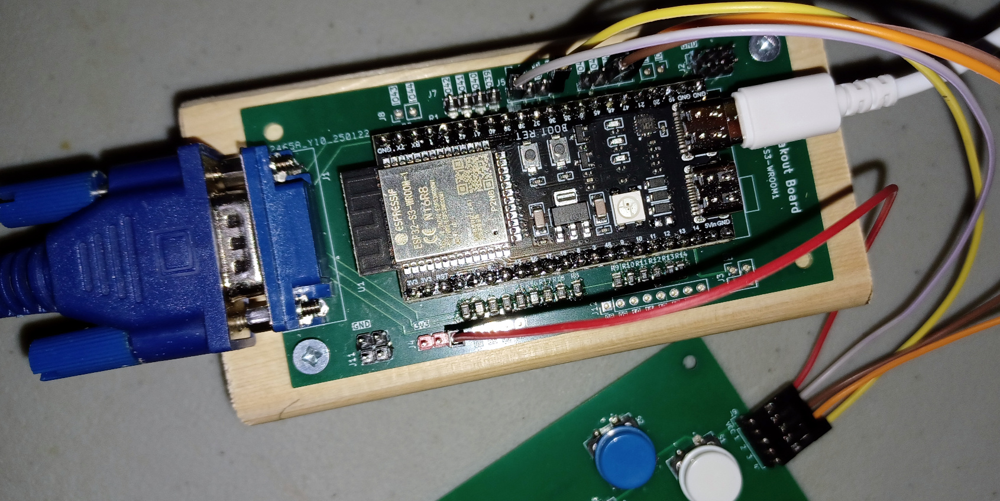
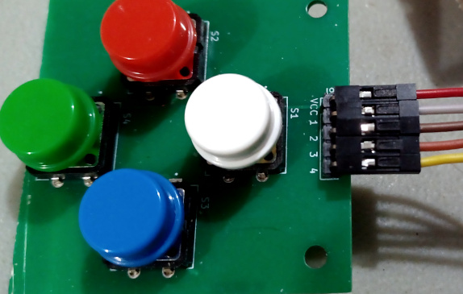

# About

This project is a game port to ESP32S3 microcontroller of an MS-DOS Game.

Current status is alpha. 90% of the core mechanic has been implemented.

## Original MS-DOS


## ESP32-S3 VGA


Gameplay: https://www.youtube.com/watch?v=SPQwWkzFRpU

I am also releasing the source code for the map editor:
https://github.com/cfrankb/cs3-map-edit

Try the online version of the game:
https://cfrankb.itch.io/creepspread-iii

# Software required

esp-idf v5.3 or later.

# Installation

This project is based in part on: https://github.com/spikepavel/ESP32-S3-VGA

```Shell
git clone https://github.com/cfrankb/ESP32-S3-VGA-CS3.git
cd ESP32-S3-VGA-CS3/
idf.py set-target esp32s3
idf.py menuconfig
idf.py flash
```

# Hardware

## VGA Adaptor

An adaptor is needed to communicate with the VGA Hardware.





kicad / gerber: [cfrankb/ESP32-S3-VGA-ADAPTOR](https://github.com/cfrankb/ESP32-S3-VGA-ADAPTOR)


## Gamepad




| Aim   | GPIO Pin |
| ----- | -------- |
| UP    | 38       |
| DOWN  | 35       |
| LEFT  | 47       |
| RIGHT | 48       |

```
CGameController gamepad(GPIO_NUM_38, GPIO_NUM_35, GPIO_NUM_47, GPIO_NUM_48);
engine->attach(&gamepad);
```

The above configuration is for the ESP32S3. Pin out will vary per model.

